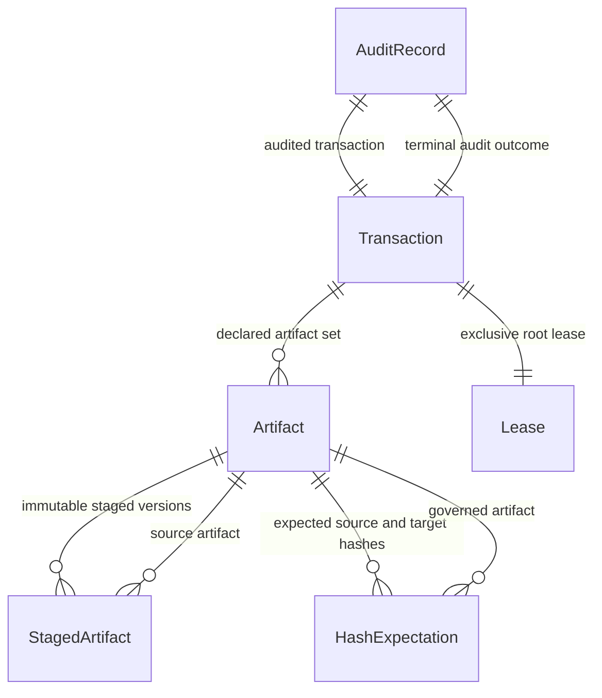

{/* Generated by `modelith render`. Do not edit by hand; edit the .modelith.yaml source and re-render. */}

# Codex Skill Router Global Artifact Guard

A brownfield domain for safely mutating machine-global Skill Router files through immutable staging, expected-hash comparison, one active lease, atomic commit or rollback, and append-only audit evidence.

## Glossary

- **`CanonicalSource`** - The repository-owned source file intended to become a deployed global artifact.
- **`FailClosed`** - A rejected transaction that leaves every live artifact byte-for-byte unchanged.
- **`GlobalRoot`** - The operator-owned directory containing deployed Skill Router files, modeled here as `/Users/speed/.codex/skill-router`.
- **`Operator`** - The single human owner who authorizes a proposed global-artifact transaction and may inspect or replay its audit history.
- **`Writer`** - A Codex session or CLI process that proposes one deterministic global-artifact transaction.

## Enums

### `ArtifactStatus`

Lifecycle of a canonical source artifact participating in a transaction.

| Value | Definition |
| --- | --- |
| `Selected` | The source path and bytes have been chosen but not staged. |
| `Staged` | Immutable bytes are sealed under a content address. |
| `Committed` | The staged bytes were atomically installed in the GlobalRoot. |
| `Reverted` | A previous commit was replaced by the recorded pre-state. |

### `AuditStatus`

Durability state of a transaction audit record.

| Value | Definition |
| --- | --- |
| `Pending` | The transaction outcome is not yet terminal. |
| `Recorded` | A terminal outcome and hashes were appended. |
| `Rejected` | The audit append failed and rollback was forced. |

### `HashExpectationStatus`

Comparison state between expected and observed bytes.

| Value | Definition |
| --- | --- |
| `Proposed` | The expected hash has been declared but not checked. |
| `Verified` | The observed bytes exactly match the expected SHA-256. |
| `Mismatched` | The observed bytes differ or cannot be read. |

### `LeaseStatus`

Exclusive ownership state for one GlobalRoot.

| Value | Definition |
| --- | --- |
| `Free` | No writer owns the root. |
| `Acquired` | Exactly one writer owns the root. |
| `Released` | The owning writer cleanly released the root. |
| `Orphaned` | A stale acquired lease requires bounded recovery. |

### `StagedArtifactStatus`

Immutability and validation state of sealed bytes.

| Value | Definition |
| --- | --- |
| `Sealed` | Bytes are content-addressed and no longer mutable by the writer. |
| `Rejected` | Validation failed before commit. |
| `Committed` | The staged bytes were installed. |
| `Retired` | The stage remains immutable evidence but is no longer installable. |

### `TransactionStatus`

Lifecycle of one global-artifact mutation attempt.

| Value | Definition |
| --- | --- |
| `Proposed` | Inputs and expected hashes are declared. |
| `Staged` | All source bytes are sealed and validated. |
| `Leased` | The transaction owns the sole active root lease. |
| `Committing` | Pre-state backups and atomic replacements are in progress. |
| `Committed` | Every target was atomically installed and post-hashes recorded. |
| `RollingBack` | A failed commit is restoring recorded pre-state. |
| `RolledBack` | Pre-state was restored and the failure audited. |
| `Rejected` | Validation or lease acquisition failed before mutation. |
| `Recovered` | A stale owner was safely resolved without promoting stale bytes. |
| `Recovering` | An operator is resolving an expired lease or incomplete rollback before any new mutation. |

## Entities

### `Artifact`

A `CanonicalSource` repository file and the corresponding target path in the GlobalRoot. It is not executable and never carries authority to run a skill.

**Relationships**

- `StagedArtifact` - 1:n - owned - immutable staged versions
- `HashExpectation` - 1:n - owned - expected source and target hashes

**Attributes**

| Name | Type | Description |
| --- | --- | --- |
| `artifactId` | string |  |
| `sourcePath` | string |  |
| `targetPath` | string |  |
| `status` | ArtifactStatus |  |
| `mode` | string |  |

**Actions**

- `select` - actor `Writer`; preserves artifact-source-pinned - Pin a repository-owned source path and GlobalRoot target path.
- `stage` - actor `Writer`; preserves artifact-source-pinned, stage-content-addressed - Bind one sealed content-addressed version to the selected artifact.
- `markCommitted` - actor `Writer`; preserves post-hash-bound, live-artifact-byte-bound - Mark a target committed only after atomic replacement and post-hash verification.
- `markReverted` - actor `Writer`; preserves rollback-prestate-only - Mark a prior commit reverted after restoring its recorded pre-state.

**Invariants**

- **artifact-source-pinned** - An `Artifact` must pin exact repository source and GlobalRoot target identities before staging.
- **live-artifact-byte-bound** - A live target byte sequence may change only through an atomic `Transaction` commit or rollback.
### `AuditRecord`

The append-only terminal record for a transaction, including all hashes, owner, rejection or success outcome, and rollback evidence.

**Relationships**

- `Transaction` - 1:1 - audited transaction

**Attributes**

| Name | Type | Description |
| --- | --- | --- |
| `recordId` | string |  |
| `transactionId` | string |  |
| `outcome` | string |  |
| `preStateHashes` | string |  |
| `postStateHashes` | string |  |
| `status` | AuditStatus |  |

**Actions**

- `append` - actor `Writer`; preserves audit-complete - Append one terminal outcome with canonical JSON and complete hash evidence.
- `rejectAppend` - actor `Writer`; preserves audit-complete, guard-fail-closed - Force rollback when the terminal audit record cannot be appended.

**Invariants**

- **audit-complete** - Every terminal `Transaction` must have exactly one durable `AuditRecord` containing actor, target, rejection code, and all relevant hashes.

### `HashExpectation`

A declared SHA-256 for source, pre-commit target, staged bytes, or post-commit target. It is evidence, not permission to bypass comparison.

**Relationships**

- `Artifact` - n:1 - governed artifact

**Attributes**

| Name | Type | Description |
| --- | --- | --- |
| `expectationId` | string |  |
| `role` | string |  |
| `expectedSha256` | string |  |
| `observedSha256` | string |  |
| `status` | HashExpectationStatus |  |

**Actions**

- `verify` - actor `Writer`; preserves hash-comparison-explicit, stale-hash-rejected - Read bytes, calculate SHA-256, and compare the exact expected digest.
- `mismatch` - actor `Writer`; preserves stale-hash-rejected, guard-fail-closed - Record a hash mismatch before any target mutation.

**Invariants**

- **hash-comparison-explicit** - Every required byte transition must have an explicit SHA-256 expectation and observed value.
- **stale-hash-rejected** - A transaction must be rejected when an observed pre-state hash differs from its declared expected hash.

### `Lease`

Exclusive, bounded ownership of one GlobalRoot for transaction verification and commit. It does not authorize arbitrary filesystem work outside declared targets.

**Attributes**

| Name | Type | Description |
| --- | --- | --- |
| `leaseId` | string |  |
| `rootPath` | string |  |
| `ownerToken` | string |  |
| `acquiredAt` | timestamp |  |
| `expiresAt` | timestamp |  |
| `status` | LeaseStatus |  |

**Actions**

- `acquire` - actor `Writer`; preserves lease-exclusive - Atomically acquire the only active lease for the root.
- `release` - actor `Writer`; preserves lease-exclusive, audit-complete - Release a cleanly terminal lease.
- `recoverOrphan` - actor `Operator`; preserves orphan-recovery-bounded, stale-hash-rejected - Expire a stale owner and allow a fresh transaction to reverify current hashes.
- `markOrphaned` - actor `Writer`; preserves orphan-recovery-bounded - Mark an abruptly abandoned lease orphaned.

**Invariants**

- **lease-exclusive** - A `GlobalRoot` may have at most one non-expired acquired `Lease`.
- **orphan-recovery-bounded** - An orphaned `Lease` may be recovered only after its declared expiry and only through an audited recovery action.

### `StagedArtifact`

One immutable, content-addressed byte sequence sealed from an `Artifact` source. It is read-only evidence and never becomes executable merely by being staged.

**Relationships**

- `Artifact` - n:1 - source artifact

**Attributes**

| Name | Type | Description |
| --- | --- | --- |
| `stageId` | string |  |
| `contentSha256` | string |  |
| `bytes` | string |  |
| `sealedAt` | timestamp |  |
| `status` | StagedArtifactStatus |  |

**Actions**

- `seal` - actor `Writer`; preserves stage-immutable, stage-content-addressed - Copy source bytes once to a content-addressed immutable stage.
- `reject` - actor `Writer`; preserves guard-fail-closed - Reject malformed, unreadable, or hash-mismatched bytes.
- `retire` - actor `Writer`; preserves stage-immutable - Retire an uninstalled stage while preserving its bytes as evidence.
- `markCommitted` - actor `Writer`; preserves stage-immutable, post-hash-bound - Mark sealed bytes installed after post-hash verification.

**Invariants**

- **stage-immutable** - A sealed `StagedArtifact` byte sequence must never change after sealing.
- **stage-content-addressed** - A `StagedArtifact` storage identity must derive from the SHA-256 of its sealed bytes.

### `Transaction`

One all-or-nothing `FailClosed` mutation attempt over a declared artifact set. It owns staging, lease, commit, rollback, and terminal audit coordination.

**Relationships**

- `Artifact` - 1:n - owned - declared artifact set
- `Lease` - 1:1 - owned - exclusive root lease
- `AuditRecord` - 1:1 - owned - terminal audit outcome

**Attributes**

| Name | Type | Description |
| --- | --- | --- |
| `transactionId` | string |  |
| `status` | TransactionStatus |  |
| `rootPath` | string |  |
| `rejectionCode` | string |  |
| `startedAt` | timestamp |  |
| `endedAt` | timestamp |  |

**Actions**

- `propose` - actor `Writer`; preserves artifact-source-pinned, hash-comparison-explicit - Declare the complete target set and every required hash expectation.
- `stage` - actor `Writer`; preserves stage-immutable, stage-content-addressed - Seal and verify every source artifact before requesting a lease.
- `acquireLease` - actor `Writer`; preserves lease-exclusive, stale-hash-rejected - Verify live pre-hashes and atomically acquire the sole root lease.
- `commit` - actor `Writer`; preserves commit-atomic, rollback-prestate-only, post-hash-bound - Back up pre-state, atomically replace targets, verify post-hashes, and append audit evidence.
- `rollback` - actor `Writer`; preserves rollback-prestate-only, guard-fail-closed - Restore only the recorded pre-state after commit or audit failure.
- `reject` - actor `Writer`; preserves guard-fail-closed - Terminalize any validation, contention, or hash mismatch without target mutation.
- `recover` - actor `Operator`; preserves orphan-recovery-bounded - Resolve an orphaned lease while forcing a fresh pre-hash verification.
- `prepareRecovery` - actor `Operator`; preserves orphan-recovery-bounded, guard-fail-closed - Pause an expired or failed transaction until bounded recovery completes.
- `leaseDenied` - actor `Writer`; preserves lease-exclusive, guard-fail-closed - Record that another writer owns the root lease.
- `staleHash` - actor `Writer`; preserves stale-hash-rejected, guard-fail-closed - Record a live pre-state hash mismatch after lease verification.
- `commitAndAuditSucceeded` - actor `Writer`; preserves commit-atomic, post-hash-bound, audit-complete - Complete the terminal commit and durable audit record.
- `commitFailed` - actor `Writer`; preserves commit-atomic, rollback-prestate-only - Begin rollback after replacement or post-hash failure.
- `auditFailed` - actor `Writer`; preserves audit-complete, rollback-prestate-only - Begin rollback because the terminal audit record cannot be appended.
- `rollbackSucceeded` - actor `Writer`; preserves rollback-prestate-only, audit-complete - Complete and audit restoration of captured pre-state.
- `rollbackFailed` - actor `Writer`; preserves guard-fail-closed, orphan-recovery-bounded - Require bounded operator recovery after rollback failure.
- `crash` - actor `Writer`; preserves orphan-recovery-bounded, guard-fail-closed - Mark an in-flight owner orphaned without allowing stale promotion.
- `recoverySucceeded` - actor `Operator`; preserves orphan-recovery-bounded, stale-hash-rejected, audit-complete - Complete recovery after fresh hash and audit evidence reconcile.

**Invariants**

- **guard-fail-closed** - Every invalid, contested, stale, or partially failed `Transaction` must leave all live target bytes unchanged.
- **commit-atomic** - A commit may expose either the complete declared post-state or the complete recorded pre-state, never a partial set.
- **rollback-prestate-only** - Rollback may restore only bytes captured by that transaction before mutation.
- **post-hash-bound** - A committed terminal record must bind every installed target to its observed post-commit SHA-256.

## Relationships

## Scenarios

### Uncontested verified commit

**Actors:** Writer, Operator

**Steps**

1. A `Writer` proposes one `Artifact` with source and target hashes.
2. The `Transaction` seals and verifies immutable bytes.
3. The `Lease` is acquired after the target pre-hash matches.
4. The `Transaction` commits atomically and verifies post-hashes.
5. The `AuditRecord` records success and releases the `Lease`.

**Invariants touched**

- **stage-immutable** - A sealed `StagedArtifact` byte sequence must never change after sealing.
- **stale-hash-rejected** - A transaction must be rejected when an observed pre-state hash differs from its declared expected hash.
- **commit-atomic** - A commit may expose either the complete declared post-state or the complete recorded pre-state, never a partial set.
- **post-hash-bound** - A committed terminal record must bind every installed target to its observed post-commit SHA-256.
- **audit-complete** - Every terminal `Transaction` must have exactly one durable `AuditRecord` containing actor, target, rejection code, and all relevant hashes.

### Stale live hash loses before mutation

**Actors:** Writer

**Steps**

1. A `Transaction` stages correct source bytes.
2. Another actor changes the live target before lease acquisition.
3. The observed pre-hash differs from the `HashExpectation`.
4. The `Transaction` is rejected without modifying the target.

**Invariants touched**

- **stale-hash-rejected** - A transaction must be rejected when an observed pre-state hash differs from its declared expected hash.
- **guard-fail-closed** - Every invalid, contested, stale, or partially failed `Transaction` must leave all live target bytes unchanged.
- **audit-complete** - Every terminal `Transaction` must have exactly one durable `AuditRecord` containing actor, target, rejection code, and all relevant hashes.

### Concurrent writers have one winner

**Actors:** Writer, Writer

**Steps**

1. Two `Writer` processes propose transactions for one `GlobalRoot`.
2. The first `Lease` acquisition succeeds.
3. The second `Lease` acquisition fails.
4. The losing `Transaction` is rejected while its sealed bytes remain evidence.

**Invariants touched**

- **lease-exclusive** - A `GlobalRoot` may have at most one non-expired acquired `Lease`.
- **guard-fail-closed** - Every invalid, contested, stale, or partially failed `Transaction` must leave all live target bytes unchanged.
- **stage-immutable** - A sealed `StagedArtifact` byte sequence must never change after sealing.

### Commit failure restores pre-state

**Actors:** Writer

**Steps**

1. A `Transaction` acquires the lease and begins commit.
2. A target replacement or post-hash check fails.
3. The `Transaction` rolls back every target from its captured pre-state.
4. The failure and rollback are audited.

**Invariants touched**

- **commit-atomic** - A commit may expose either the complete declared post-state or the complete recorded pre-state, never a partial set.
- **rollback-prestate-only** - Rollback may restore only bytes captured by that transaction before mutation.
- **guard-fail-closed** - Every invalid, contested, stale, or partially failed `Transaction` must leave all live target bytes unchanged.
- **audit-complete** - Every terminal `Transaction` must have exactly one durable `AuditRecord` containing actor, target, rejection code, and all relevant hashes.

### Orphan lease recovery forces reverification

**Actors:** Operator, Writer

**Steps**

1. A crashed `Writer` leaves an expired acquired `Lease`.
2. The `Operator` records bounded orphan recovery.
3. A new `Transaction` must rehash current live bytes before staging or commit.

**Invariants touched**

- **orphan-recovery-bounded** - An orphaned `Lease` may be recovered only after its declared expiry and only through an audited recovery action.
- **stale-hash-rejected** - A transaction must be rejected when an observed pre-state hash differs from its declared expected hash.
- **audit-complete** - Every terminal `Transaction` must have exactly one durable `AuditRecord` containing actor, target, rejection code, and all relevant hashes.

### No execution authority

**Actors:** Writer, Operator

**Steps**

1. A `StagedArtifact` names a Python source file.
2. The guard seals, compares, installs, and audits bytes only.
3. No skill is selected or executed by the transaction.

**Invariants touched**

- **stage-immutable** - A sealed `StagedArtifact` byte sequence must never change after sealing.
- **live-artifact-byte-bound** - A live target byte sequence may change only through an atomic `Transaction` commit or rollback.
